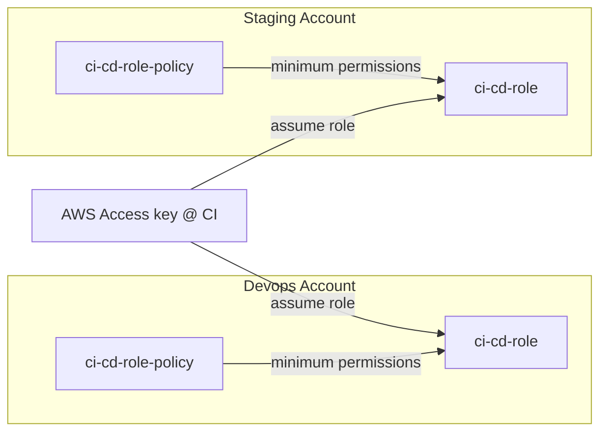

# otf-iac-aws-s3
Open Tofu Self-Service IaC for S3 Buckets

## Overview
This is a self-service Infrastructure as Code (IaC) solution for managing S3 on AWS. Designed as an opinionated framework, it provides a structured approach to creating and managing S3 buckets. 

The framework is built on top of the [Terraform AWS Provider](https://registry.terraform.io/providers/hashicorp/aws/latest/docs) and [Terraform AWS S3 Bucket Module](https://registry.terraform.io/modules/terraform-aws-modules/s3-bucket/aws/latest).


## Prerequisites

- (Optional) [devkit](https://github.com/42dev-co/devkit) already provides:
    - `go-task` for task automation
- (Required) Docker Desktop or equivalent (all tools except go-tasks are run as container)
- (Optional) [go-tasks](https://taskfile.dev/) if you choose not to install `devkit`.

## Batteries included
- Open Policy Agent for policy as code and cost/budget control.
- Infacost for cost estimation 
- Scaffolded VPC comes with S3 bucket and DynamoDB Gateway Endpoint as they are free. :) 


# Getting Started

1. Clone this repository
2. Go to `base/provider.tf.tmpl` set bucket name  to your intended bucket name. You may choose to use other backend instead of S3.
3. Create an account and region if not already created in the workspaces folder by running:
   ```bash
   task scaffold account=<account> region=<region> account_id=<aws_account_id> group=<group_name> domain=<domain>
   ```
5. Edit yamls in your `<workspace_path>/resources/` to define how you want build your VPC. E.g.

  ```
  #           account   region       group
  workspaces/account/ap-southeast-1/system/resources/main.yaml
  ```

## Task Automation

To see what task you can run, run:
```bash
aws sso login --profile <profile_name> 
```
> **NOTE:** Since the session is the same for all accounts, you only need to login once.


# Documentation

## Setting Up Login

### AWS IAM Identity Center or AWS SSO
We recommend to use AWS IAM Identity Center or AWS SSO to login to your AWS account. See [here](https://github.com/42dev-co/otf-aws-sso) for the framework. 

**~/.aws/conf**
```conf
[profile devops]
sso_session = example.com
sso_account_id = 1234567890
sso_role_name = AdministratorAccess
region = ap-southeast-1
output = json

[profile staging]
sso_session = example.com
sso_account_id = 0123456789
sso_role_name = AdministratorAccess
region = ap-southeast-1
output = json

[sso-session example.com]
sso_start_url = https://myaws.awsapps.com/start/#/
sso_region = ap-southeast-1
sso_registration_scopes = AdministratorAccess
```

**To sign in**
```bash
aws sso login --profile devops
```

## Files to work on

1. You only need to put your focus on `resources` folder, unless you are interested in modifying the base configuration or adding new features. You can create folders with resources and place the `main.yaml` file in it.

```bash
resources
├── main.yaml
├── some_folder
    ├── main.yaml
```


## CI/CD login in 

It is recommended to use [this iam framework](https://github.com/42dev-co/otf-aws-iam) to manage IAM roles and permissions.

### Diagram

This setup uses an AWS Access Key with minimal permissions in the CI/CD environment to assume specific roles in target AWS accounts. Each target account has an IAM role (`ci-cd-role`) configured to grant the CI/CD environment the ability to perform only the required actions. The roles follow the principle of **least privilege** by restricting access to necessary resources and actions. The CI/CD process assumes these roles dynamically, leveraging temporary credentials for secure and isolated access to each account's resources.

### Configuration
```
[default]
region = ap-southeast-1

[profile devops]
region = ap-southeast-1
role_arn = arn:aws:iam::1234567890:role/devops-assume-role
source_profile = default
role_session_name = devopsSession

[profile staging]
region = ap-southeast-1
role_arn = arn:aws:iam::0123456789:role/devops-assume-role
source_profile = default
role_session_name = stagingSession
```
